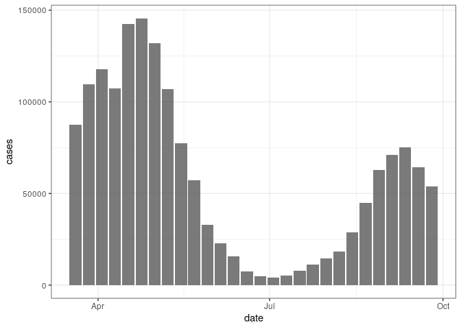
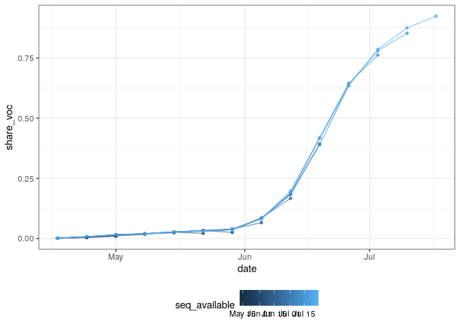
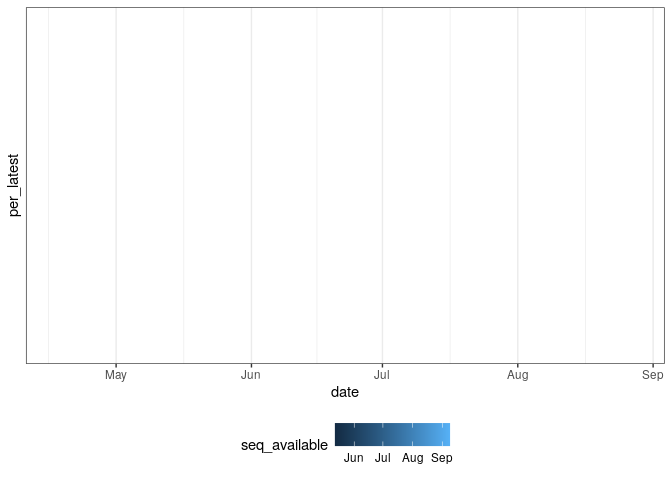

Aggregate case notification and sequence data for Germany
================

``` r
library(data.table)
```

    ## data.table 1.14.0 using 3 threads (see ?getDTthreads).  Latest news: r-datatable.com

``` r
library(ggplot2)
library(here)
```

    ## here() starts at /workspaces/evaluate-delta-for-forecasting

## Case notification data

  - Load truth data from the RKI via the Germany/Poland forecasting hub
    and process.

<!-- end list -->

``` r
cases <- fread("https://raw.githubusercontent.com/KITmetricslab/covid19-forecast-hub-de/master/data-truth/RKI/truth_RKI-Incident%20Cases_Germany.csv") # nolint

# Restrict to cases in Germany and format date
cases <- cases[location == "GM"]
cases[, date := as.Date(date)]

# Summarise to weekly cases starting on Saturday to Sync with the forecast hubs
cases[, cases := frollsum(value, n = 7)]

# Filter from the 20th March and keep only Saturdays
cases <- cases[date >= as.Date("2021-03-20")]
cases <- cases[weekdays(date) %in% "Saturday"]

# Only most recennt case data is available
cases[, cases_available := date]

# Drop unnecessary columns
set(cases, j = c("value", "location", "location_name"), value = NULL)

# Summary
summary(cases)
```

    ##       date                cases        cases_available     
    ##  Min.   :2021-03-20   Min.   :  4181   Min.   :2021-03-20  
    ##  1st Qu.:2021-05-06   1st Qu.: 15328   1st Qu.:2021-05-06  
    ##  Median :2021-06-22   Median : 55568   Median :2021-06-22  
    ##  Mean   :2021-06-22   Mean   : 58220   Mean   :2021-06-22  
    ##  3rd Qu.:2021-08-08   3rd Qu.: 92281   3rd Qu.:2021-08-08  
    ##  Max.   :2021-09-25   Max.   :145568   Max.   :2021-09-25

## Sequence notification data

  - Sequence data sourced from RKI reports see the SI for more details.

<!-- end list -->

``` r
sequences <- fread("https://raw.githubusercontent.com/dwolffram/covid19-variants/main/data/sequencing_germany.csv") # nolint

# Get total sequence count
sequences[, seq_total := rowSums(.SD, na.rm = TRUE),
  .SDcols = grep("_count", colnames(sequences))
]

# Pull out and format variables of interest
sequences <- sequences[
  ,
  .(
    date = week_end, seq_total, seq_voc = B.1.617.2_count,
    share_voc = B.1.617.2_proportion / 100, seq_available
  )
]

# Check sequence totals and proportions
sequences[, est_seq_total := seq_voc / share_voc]

# Replace proprotion using totals and voc sequences
sequences[, share_voc := seq_voc / seq_total][, est_seq_total := NULL]

# Include sequences from 18th of April
sequences <- sequences[date >= as.Date("2021-04-18")]

# Summary
summary(sequences)
```

    ##       date              seq_total       seq_voc        share_voc      
    ##  Min.   :2021-04-18   Min.   :   0   Min.   :  3.0   Min.   :0.00080  
    ##  1st Qu.:2021-05-02   1st Qu.:   0   1st Qu.: 34.0   1st Qu.:0.01191  
    ##  Median :2021-05-30   Median :   0   Median : 89.0   Median :0.02645  
    ##  Mean   :2021-06-01   Mean   :1474   Mean   :134.2   Mean   :0.12312  
    ##  3rd Qu.:2021-06-27   3rd Qu.:3611   3rd Qu.:143.0   3rd Qu.:0.08237  
    ##  Max.   :2021-08-29   Max.   :4547   Max.   :643.0   Max.   :0.92376  
    ##                                      NA's   :105     NA's   :105      
    ##  seq_available       
    ##  Min.   :2021-05-12  
    ##  1st Qu.:2021-07-03  
    ##  Median :2021-08-05  
    ##  Mean   :2021-07-27  
    ##  3rd Qu.:2021-08-26  
    ##  Max.   :2021-09-09  
    ## 

## Merge, explore, and save data

  - Merge duplicating case data for all sequence versions. Sequences are
    only available aggregated by week from Sunday. Approximate the same
    timespan as the case data by changing the weekly reference date

<!-- end list -->

``` r
notifications <- merge(cases, copy(sequences)[, date := date - 1],
  by = "date", all.x = TRUE
)

notifications[, `:=`(location_name = "Germany", location = "DE")]
setcolorder(notifications, c("date", "location_name", "location"))

# save to observations folder
fwrite(notifications, file = here("data/observations/rki.csv"))

# Summary
summary(notifications)
```

    ##       date            location_name        location             cases       
    ##  Min.   :2021-03-20   Length:215         Length:215         Min.   :  4181  
    ##  1st Qu.:2021-05-01   Class :character   Class :character   1st Qu.: 14654  
    ##  Median :2021-05-29   Mode  :character   Mode  :character   Median : 57310  
    ##  Mean   :2021-06-01                                         Mean   : 64328  
    ##  3rd Qu.:2021-06-26                                         3rd Qu.:124926  
    ##  Max.   :2021-09-25                                         Max.   :145568  
    ##                                                                             
    ##  cases_available        seq_total       seq_voc        share_voc      
    ##  Min.   :2021-03-20   Min.   :   0   Min.   :  3.0   Min.   :0.00080  
    ##  1st Qu.:2021-05-01   1st Qu.:   0   1st Qu.: 34.0   1st Qu.:0.01191  
    ##  Median :2021-05-29   Median :   0   Median : 89.0   Median :0.02645  
    ##  Mean   :2021-06-01   Mean   :1474   Mean   :134.2   Mean   :0.12312  
    ##  3rd Qu.:2021-06-26   3rd Qu.:3611   3rd Qu.:143.0   3rd Qu.:0.08237  
    ##  Max.   :2021-09-25   Max.   :4547   Max.   :643.0   Max.   :0.92376  
    ##                       NA's   :8      NA's   :113     NA's   :113      
    ##  seq_available       
    ##  Min.   :2021-05-12  
    ##  1st Qu.:2021-07-03  
    ##  Median :2021-08-05  
    ##  Mean   :2021-07-27  
    ##  3rd Qu.:2021-08-26  
    ##  Max.   :2021-09-09  
    ##  NA's   :8

  - Plot cases in Germany

<!-- end list -->

``` r
ggplot(unique(notifications[, .(date, cases)])) +
  aes(x = date, y = cases) +
  geom_col(alpha = 0.8) +
  theme_bw()
```

<!-- -->

  - Plot proportion of sequences that were Delta by sequence
    availability date.

<!-- end list -->

``` r
ggplot(notifications[!is.na(share_voc)]) +
  aes(x = date, y = share_voc, col = seq_available, group = seq_available) +
  geom_point(size = 1.1, alpha = 0.8) +
  geom_line(alpha = 0.6) +
  theme_bw() +
  theme(legend.position = "bottom")
```

<!-- -->

  - Plot relative change in the proportion of sequences that were Delta
    between each release of sequence data and the latest available
    release.

<!-- end list -->

``` r
latest_seq <- notifications[, .SD[seq_available == max(seq_available)],
  by = date
]

seq_change <- merge(
  notifications[, .(date, share_voc, seq_available)],
  latest_seq[, .(date, latest_voc = share_voc)],
  by = "date"
)

seq_change[, per_latest := share_voc / latest_voc]

ggplot(seq_change) +
  aes(x = date, y = per_latest, col = seq_available, group = seq_available) +
  geom_point(size = 1.1, alpha = 0.8) +
  geom_line(alpha = 0.6) +
  theme_bw() +
  theme(legend.position = "bottom")
```

    ## Warning: Removed 207 rows containing missing values (geom_point).

    ## Warning: Removed 207 row(s) containing missing values (geom_path).

<!-- -->
